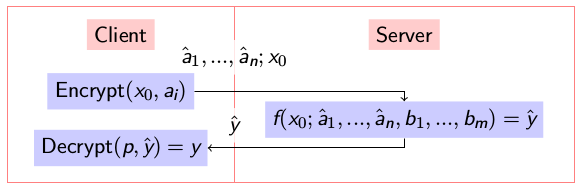

libshe
------

Symmetric homomorphic encryption library.


## Introduction

Homomorphic encryption is a kind of encryption that allows to execute functions over the ciphertexts without decrypting them. This library implements a symmetric variant of originally asymmetric homomorphic encryption scheme over the integers by van Dijk et al. [(DGHV10)][DGHV10] using ciphertext compression techniques from [(CNT11)][CNT11]. The symmetricity of the scheme means that only the private key is used to encrypt and decrypt ciphertexts. A relatively small public element, however, is used in homomorphic operations, but it is not a real public key.

Such scheme is useful in secure function evaluation setting, where a client encrypts an input to an algorithm using their private key, sends it to a server which executes an algorithm homorphically, and sends the output back to the client. The client then obtains the output of the algorithm by decrypting server response using the private key.

See the following diagram for visual explanation.

- Let _f_ be an algorithm to be evaluated on a server.
- Let _a[1], a[2], ... a[n]_ be inputs of _f_ that client provides to the server.
- Let _b[1], b[2], ... b[n]_ be inputs of _f_ that server possesses.
- Let _p_ be the client's private key, and _x[0]_ be the corresponding public element



See [technical report][Kul15] for details.


## Installation

### Requirements

- [boost](http://www.boost.org/) >= 1.57
- [GMP](https://gmplib.org/) >= 6.0.0

### Building

Run tests

```
make test BOOST_DIR=/path/to/boost/libraries
```

Produce a library in `build` directory:

```
make BOOST_DIR=/path/to/boost/libraries
```

_Note_. Default value of `BOOST_DIR` is `/usr/local/lib`.

## Usage

```cpp
using she::ParameterSet;
using she::PrivateKey;
using she::HomomorphicArray;

// Generate parameter set so that the library:
// - Has medium security level (62-bit)
// - Allows for at least 30 bit multiplications
// - Seeds the non-secure random number generator with 42

const ParameterSet params = ParameterSet::generate_parameter_set(62, 1, 42);

// Generate private key
const PrivateKey sk(params);

// Encrypt plaintext
const vector<bool> plaintext = {1, 0, 1, 0, 1, 0, 1, 0};
const auto compressed_ciphertext = sk.encrypt();

// ...
// Serialize and send compressed ciphertext
// ...

// Expand the ciphertext to perform operations
const auto ciphertext = compressed_ciphertext.expand();

// Execute some algorithm
const vector<bool> another_plaintext = {1, 1, 1, 1, 1, 1, 1, 1};
const auto response = ciphertext ^ HomomorphicArray(another_plaintext);

// ...
// Serialize and send back the response
// ...

// Decrypt to obtain the algorithm output
const auto decrypted_response = sk.decrypt(response);
const vector<bool> expected_result = {0, 1, 0, 1, 0, 1, 0, 1};
assert(decrypted_response == expected_result);

```

## Roadmap

- [ ] Documentation
- [ ] Include ciphertext size, encryption, decryption, and homomorphic evaluation timing estimates
- [ ] Comparison with [HElib](https://github.com/shaih/HElib)


[DGHV10]: http://eprint.iacr.org/2009/616.pdf
[CNT11]: http://eprint.iacr.org/2011/440.pdf
[Kul15]: http://bogdankulynych.me/papers/vdghv.pdf